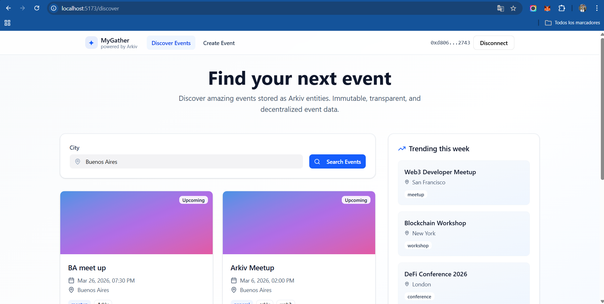
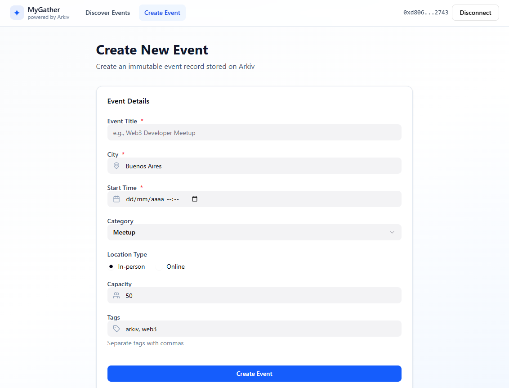
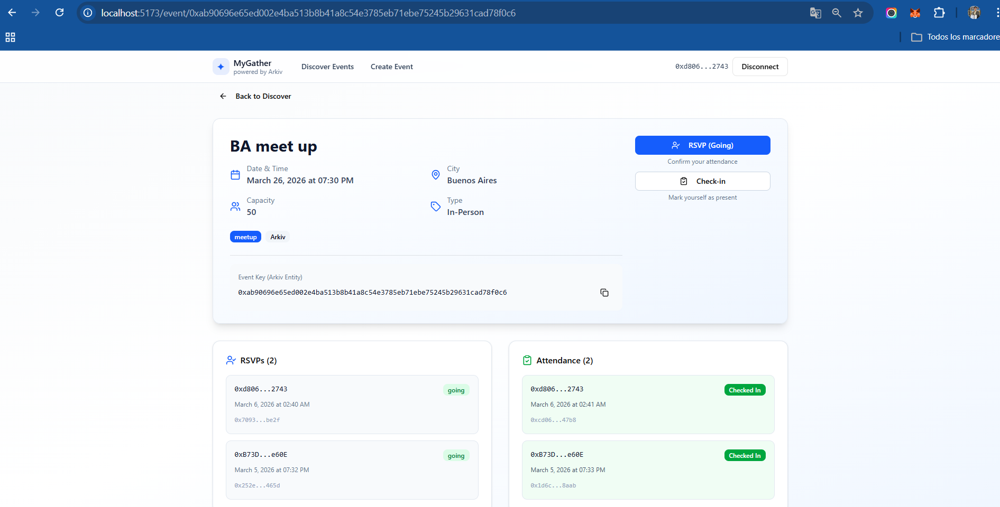

# MyGather — Web3 Event Platform (powered by Arkiv)

MyGather is a Web3-native event platform built on **Arkiv** as the database layer. Instead of storing events and attendance in a centralized Web2 database, MyGather stores **events, RSVPs, and check-ins as Arkiv entities** that are **queryable by attributes** and **linked by a shared eventKey**.

Built for the **[ARKIV] Web3 Database Builders Challenge**.



---

## What we built

MyGather ships a full, working MVP that supports the complete user flow:

1) **Create Event** → writes an Arkiv entity (`type=event`)  
2) **Discover Events** → queries Arkiv entities filtered by attributes (e.g. `city`)  
3) **RSVP (Going)** → writes an Arkiv entity (`type=rsvp`) linked to the event via `eventKey`  
4) **Check-in** → writes an Arkiv entity (`type=attendance`) linked to the event via `eventKey`  
5) **Live lists** → Event Detail page loads and renders RSVPs + Attendance for that event

**Core relationship:** `event` → `rsvp` → `attendance` (all connected by `eventKey`)

---

## Why Arkiv / What makes it “Web3 database-native”

Traditional event platforms store event data in a platform-owned database (Postgres, Firebase, etc.). MyGather uses Arkiv as the database layer so records become:

- **Wallet-authored writes** (writes are signed by the backend wallet in this MVP)
- **Queryable via indexed attributes** (e.g., list upcoming events by city)
- **Composable records** with explicit linking (RSVP and Attendance reference the Event by `eventKey`)
- **Time-scoped** via TTL (entities can be set to expire)

This hackathon entry emphasizes Arkiv’s core strengths: **entities + attributes + queries + relationships**.

---

## Data Model (Arkiv Entities)

All entities share:
- `app = arkiv-events` (namespacing so we don’t mix with other apps)
- `type = event | rsvp | attendance`

### 1) Event Entity (`type=event`)
Represents an event created by an organizer.

**Key attributes (indexable):**
- `app`: `arkiv-events`
- `type`: `event`
- `title`: string
- `city`: string
- `startAt`: ISO-like string (stored both in payload + attribute for filtering)
- `category`: string (meetup/workshop/etc.)
- `locationType`: `in-person` or `online`
- `capacity`: number (stored as string in attributes)
- `status`: `upcoming`
- `tags`: stored as a single string (see note below)

**Payload (JSON used by UI):**
```json
{
  "title": "Arkiv Meetup",
  "city": "Sucre",
  "startAt": "2026-03-05T22:00",
  "category": "meetup",
  "locationType": "in-person",
  "capacity": 50,
  "tags": ["Web3"],
  "organizer": "0x..."
}
```

### 2) RSVP Entity (`type=rsvp`)

Represents an attendee RSVP for a given event. Linked by `eventKey`.

**Key attributes:**

* `app`: `arkiv-events`
* `type`: `rsvp`
* `eventKey`: `<event key>`
* `attendee`: `<wallet address>`
* `status`: `going` (or `canceled` if expanded)
* `createdAt`: ISO timestamp

**Payload (JSON):**

```json
{
  "eventKey": "0x...",
  "attendee": "0x...",
  "status": "going",
  "createdAt": "2026-03-05T23:00:00.000Z"
}
```

### 3) Attendance Entity (`type=attendance`)

Represents a check-in record for a given event. Linked by `eventKey`.

**Key attributes:**

* `app`: `arkiv-events`
* `type`: `attendance`
* `eventKey`: `<event key>`
* `attendee`: `<wallet address>`
* `checkedInAt`: ISO timestamp

**Payload (JSON):**

```json
{
  "eventKey": "0x...",
  "attendee": "0x...",
  "checkedInAt": "2026-03-05T23:05:00.000Z",
  "checkedInBy": "0x..."
}
```

### Important note: tags and Arkiv attribute keys

Arkiv attributes cannot contain duplicated keys in a single entity. To support multiple tags:

* We store tags as an array in the payload for UI
* We store tags as a **single** attribute `tags="tag1,tag2"` for indexing

---

## Query Design (Arkiv-first)

MyGather demonstrates Arkiv queries via the backend:

### Discover Events (by city)

Fetch events by attribute filters:

* `app=arkiv-events`
* `type=event`
* `city=<CITY>`
* `status=upcoming`

This powers the `/discover` page.

### Load RSVPs and Attendance (by eventKey)

Fetch RSVP and Attendance records with:

* `app=arkiv-events`
* `type=rsvp` + `eventKey=<EVENT_KEY>`
* `app=arkiv-events`
* `type=attendance` + `eventKey=<EVENT_KEY>`

This powers the Event Detail page and demonstrates linked-record querying.

---

## Architecture

This repository is a simple monorepo:

```
MyGather/
  backend/   # Node + Hono API (writes/queries Arkiv)
  frontend/  # Vite + React UI (Discover / Create / Detail)
  README.md
```

### Backend (Node + Hono + Arkiv SDK)

Responsibilities:

* Owns the Arkiv wallet (signs writes)
* Creates Arkiv entities (event/rsvp/attendance)
* Queries Arkiv entities (Discover + Event detail lists)
* Exposes a clean REST API for the frontend

### Frontend (Vite + React)

Three pages:

* **Discover Events**: search by city, list event cards
* **Create Event**: form → create event → show eventKey + “View Event”
* **Event Detail**: RSVP + Check-in + live RSVP/Attendance lists

---

## Backend API

Base URL (local): `http://localhost:8787`

### Health

* `GET /` → `{ ok: true, app: "arkiv-events", address: "0x..." }`

### Events

* `POST /events` → create event entity
* `GET /events?city=...` → list events by city
* `GET /event?eventKey=...` → fetch a single event (used by Event Detail)

### RSVP

* `POST /rsvp` → create RSVP entity
* `GET /rsvps?eventKey=...` → list RSVPs for an event

### Attendance

* `POST /checkin` → create attendance entity
* `GET /attendance?eventKey=...` → list attendance for an event

---

## Wallet & Gas Model (Hackathon-friendly)

MyGather uses a **gasless relayer** pattern for the MVP:

- Users **connect an EVM wallet (MetaMask)** to identify themselves (`attendee` address).
- The backend wallet signs and pays for Arkiv writes (Create Event / RSVP / Check-in).
- This makes the app easy to test: **no user gas required**, but actions are still linked to the user’s wallet address.

Security note (MVP): the backend currently trusts the `attendee` address sent by the client.
A production version would add **signature verification (EIP-712 / SIWE)** to prove the user owns the address.

---

## Running locally

### Prerequisites

* MetaMask (or any wallet that injects `window.ethereum`) to connect an address for RSVP / Check-in
* Node.js 20+ (recommended 22+)
* A testnet private key funded on Arkiv Kaolin (test ETH)

---

## 1) Backend setup

```bash
cd backend
npm install
```

Create `backend/.env`:

```bash
PRIVATE_KEY=0xYOUR_TESTNET_PRIVATE_KEY
```

Run the backend:

```bash
npm run start
```

Verify:

* Open `http://localhost:8787/` and confirm you get JSON.

> Security: never commit `.env`. Use `.env.example` in the repo.

---

## 2) Frontend setup

```bash
cd frontend
npm install
npm run dev
```

Open:

* `http://localhost:5173/discover`

---

## Demo flow (recommended 60–90s video)

0. Click **Connect Wallet** (MetaMask) to set your attendee address
1. Go to **Create Event**
2. Fill the form and click **Create Event**
3. Click **View Event** to open Event Detail
4. Click **RSVP (Going)** and show RSVPs list increment
5. Click **Check-in** and show Attendance list increment
6. Return to **Discover** and show the event card listed by city

---

## Screenshots

### Discover Events


### Create Event


### Event Detail (RSVP + Attendance)


---

## Hackathon alignment (why this should score well)

* **Arkiv-native storage**: events/RSVPs/attendance stored as Arkiv entities
* **Queryable attribute design**: city/status/type/app used as filters
* **Linked records**: RSVP and Attendance reference the Event via `eventKey`
* **Working reference implementation**: full-stack, working UI, open source

---

## Future extensions (post-hackathon)

* User-owned writes directly from the browser wallet (instead of backend-signed writes)
* RSVP cancellation / attendee gating / capacity enforcement
* Tag filtering and date-range queries
* Organizer dashboard + analytics
* Verifiable attendance credentials (NFT / attestations) built on the attendance entity
